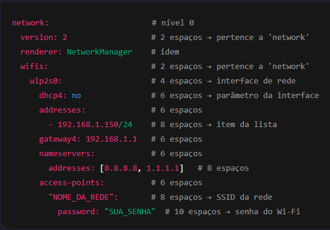

# Contexto
Como o servidor foi configurado inicialmente utilizando rede Wi-Fi, e durante a instalação não tive atenção à configuração correta da interface de rede, foi necessário criar e ajustar manualmente arquivos de configuração do **Netplan**.

# Erro 1 — Criação do arquivo de configuração Wi-Fi

> Criação e edição do arquivo de configuração:

Caminho: ``/etc/netplan/00-installer-config-wifi.yaml``



Após a edição, foram executados os comandos:

```bash
$ netplan try
$ netplan apply
```
---

# Erro 2 — Conflito entre arquivos Netplan

Durante a configuração, passou a existir dois arquivos **Netplan** no diretório:

- ``/etc/netplan/00-installer-config-wifi.yaml``

- ``/etc/netplan/00-installer-config.yaml``

Como o ambiente estava utilizando rede Wi-Fi em vez de rede cabeada, o arquivo correto a ser considerado era o de Wi-Fi.
Entretanto, mesmo com dados corretos da rede e identação válida, ao executar:

```bash
netplan try
```
O seguinte erro ocorria:

> <font color="#ff0000"> [failed to start netwokmanager.service: unit networkmanager.service not found]</font>

## Causa

> O **Netplan** processa os arquivos em ordem alfabética.
Arquivos com prefixos menores (ex.: ``00-...``) são aplicados antes de arquivos com prefixos maiores (``50-...``, ``99-...``).

### Nesse caso:

- O arquivo ``00-installer-config.yaml`` (não utilizado) estava sendo aplicado primeiro;
- Ele sobrescrevia/invalidava a configuração Wi-Fi;
- Isso resultava na falha ao iniciar o **NetworkManager**.

## Solução aplicada

Renomeei o arquivo que não deveria ser priorizado, alterando seu prefixo numérico:

### Antes:

```bash
/etc/netplan/00-installer-config.yaml
```

### Depois:

```bash
/etc/netplan/50-installer-config.yaml
```
Dessa forma, o arquivo de Wi-Fi passou a ser processado primeiro.

### Após a alteração:

```bash
$ netplan try
$ netplan apply
```

### Resultado

✅ Interface de rede inicializada corretamente
✅ Conectividade restaurada
✅ Testes de ping funcionando normalmente

> **Status**: <font color="#00b050">Resolvido</font> 
