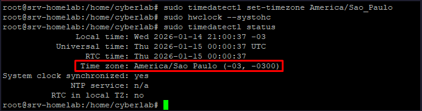

# Configurando data e hora

### 1. Instalando NTP

```bash
sudo apt update && sudo apt install ntp
```
---

### 2. Verificando status

```bash
sudo timedatectl status
```
---

### 3. Definindo fuso horario

```bash
sudo timedatectl set-timezone America/Sao_Paulo
```
---

### 4. Verificando status

```bash
sudo timedatectl status
```

